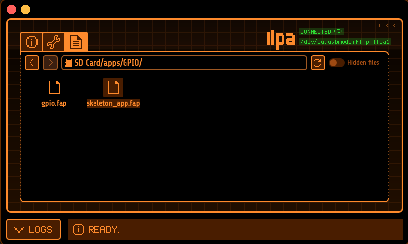

# The GitFather's Army Knife for Flipper Zero

Based on: [Skeleton App](https://github.com/jamisonderek/flipper-zero-tutorials/tree/main/ui/skeleton_app) @ [flipper-zero-tutorials
](https://github.com/jamisonderek/flipper-zero-tutorials)

Personal required firmware: [0.98.3](https://github.com/flipperdevices/flipperzero-firmware/releases/tag/0.98.3)

## Installation

- checkout Flipper Zero firmware: `git clone --branch 0.98.3 https://github.com/flipperdevices/flipperzero-firmware flipperzero-firmware-v0.98.3`
- change to `flipperzero-firmware-v0.98.3` folder
- initially run `./fbt`
- copy [applications_user/ folder](./applications_user/) to root directory of checkout firmware
- run `./fbt fap_dist`
- upload `dist/f7-D/apps/GPIO/skeleton_app.fap` file from fireware to Flipper Zero with [qFlipper](https://flipperzero.one/update)

- on Flipper:
  - click `OK`
  - select `Apps/GPIO/[WIP] Skeleton Sample App`
